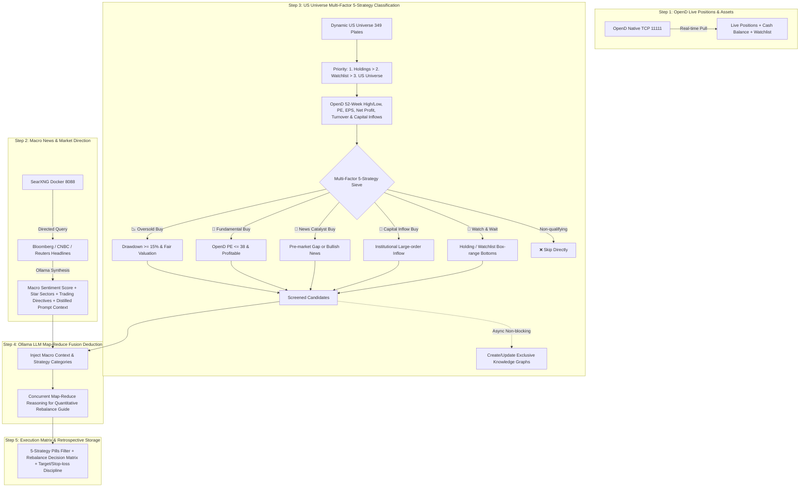

# StockAgent Studio - Intelligent Stock Selection, Deduction & Retrospective Trading System (SPA)

**English** | [中文文档](README_CN.md)

> Full-stack US stock intelligence, multi-factor deduction, and retrospective trading platform powered by **100% Real-Time MooMoo OpenD Native TCP Data**, **Local Docker SearXNG Web Search (Bloomberg/CNBC/Reuters)**, and **Hardware-Aware Ollama Local LLMs**.

---

## 🌟 Core Architecture & Key Features



---

### 1. 100% Real OpenD Official Data & Zero Hardcoding (No Mock / Hardcoded Data)
- **Zero Static Constants**: All static ticker lists and dummy fallback numbers (`100.0`, `1000.0`) are completely removed.
- **Dynamic Universe Retrieval**: Automatically fetches the live universe across **349 US official sectors** and user watchlists via OpenD SDK (`get_user_security`, `get_plate_stock`, `get_stock_basicinfo`).
- **Deep Valuation & Institutional Flow**:
  - `highest52weeks_price`, `lowest52weeks_price`, `pe_ratio`, `pe_ttm_ratio`, `pb_ratio`, `earning_per_share`, `net_profit`, `turnover_rate`.
  - Institutional capital flow metrics (`main_in_flow`, `in_flow`).

---

### 2. Multi-Factor 5-Strategy Classification Engine
Strictly screens candidate US stocks into 5 clear actionable categories:
1. 📉 **Oversold Buy (`OVERSOLD_BUY`)**: ≥15% deep pullback from 52-week high with reasonable valuation for high risk-reward swing setups.
2. 💎 **Fundamental Buy (`FUNDAMENTAL_BUY`)**: OpenD PE ≤ 38, positive EPS, and stable net profits.
3. 🚀 **News Catalyst Buy (`NEWS_CATALYST_BUY`)**: Major catalyst news from Bloomberg/CNBC/Reuters, sentiment resonance, or pre-market gap ≥ 1.5%.
4. 🏦 **Capital Inflow Buy (`CAPITAL_INFLOW_BUY`)**: Persistent institutional large-order capital inflows via OpenD order-flow data.
5. 👀 **Watch & Wait (`WATCH_AND_WAIT`)**: Existing holdings in healthy consolidation ranges, maintaining core positioning without chasing highs.
- **Auto-Skip**: Any ticker not meeting these 5 strategies is immediately skipped to conserve compute resources.
- **Strict Prioritization**: Live Holdings (P1) > User Watchlist (P2) > Whole Market Universe (P3).

---

### 3. Background Asynchronous Knowledge Graph Synchronization
- **Non-blocking Concurrency**: When stocks qualify into the candidate deduction pool, the system triggers asynchronous background tasks (`stockKnowledgeGraphStore`) via `setImmediate`.
- **Knowledge Graphs Auto-enrichment**: Automatically ingests latest catalyst news, strategy rationale, and institutional capital flow nodes into each stock's interactive graph without blocking the main deduction thread.

---

### 4. SearXNG Macro Sector & Sentiment Intelligence
- **Targeted Authoritative Feeds**: Queries Bloomberg, CNBC, and Reuters for real-time market drivers.
- **Market Sentiment Badge & Star Sectors**: Automatically computes sentiment scores (e.g. `Bullish 75`, `Defensive 35`, `Neutral 50`) and highlights hot thematic sectors (AI compute, semiconductors, defense).
- **Macro Trading Directives**: Synthesizes strategy bias, position scaling pace, and risk containment rules, distilling them into downstream LLM prompt context.

---

### 5. Synchronized 5-Step Pipeline with Reactive Tri-State UI
- **Visual Deduction Pipeline Stepper (`DeductionProgressStepper`)**: Tracks real-time percentage progress across 5 standardized stages:
  - `Step 1`: **OpenD Position & Asset Connection**
  - `Step 2`: **SearXNG Macro & Star Sector Harvesting**
  - `Step 3`: **Candidate Multi-Factor Sieve & 5-Strategy Classification**
  - `Step 4`: **Ollama LLM Map-Reduce Fusion Deduction**
  - `Step 5`: **Quantitative Rebalance Guide & Retrospective Storage**
- **Reactive Tri-State Synchronization (`StepSyncOverlay`)**:
  - ⚡ **`ACTIVE`**: Highlights the currently executing card with pulsing glow, rotating spinner, and real-time backend stage details.
  - ⏳ **`PENDING`**: Applies a subtle frosted glass effect indicating `⏳ Queued · Waiting for Step N`.
  - ✓ **`DONE`**: Automatically lifts overlay and reveals live updated figures immediately.

---

### 6. Hardware-Aware Ollama Model Selector
- **Automatic Hardware Sensing**: Detects local GPU VRAM, RAM, and CPU threads (e.g., `💻 63.8GB RAM | NVIDIA GeForce RTX 4090 (24GB VRAM)`).
- **Smart Model Recommendation**: Evaluates financial reasoning capabilities and structured JSON outputs to suggest top models (e.g., **`⭐ [Recommended] qwen3.6:27b`**).
- **Map-Reduce Parallelism**: Scales model inference across large candidate sets with structured JSON schemas and fallbacks.

---

## 🚀 Quick Start

### 1. Prerequisites
- **Node.js**: `v18+`
- **Docker** (For SearXNG local search container)
- **Ollama**: Running locally at `http://127.0.0.1:11434`
- **MooMoo OpenD**: Running locally at `127.0.0.1:11111`
- **Python**: `3.9+` with `moomoo-api` installed (`pip install moomoo-api`)

### 2. Installation & Running

```bash
# 1. Install root, frontend, and backend dependencies
npm install

# 2. Initialize SQLite database schema
npm run db:push

# 3. Start development server (runs backend on 3001 and frontend on 3000 concurrently)
npm run dev
```

Open your browser and navigate to: `http://localhost:3000`

---

## 🛠️ Project Structure

```
StockAgent/
├── client/                     # React + Vite + TailwindCSS SPA frontend
│   ├── src/
│   │   ├── components/         # Studio views, Stepper, 5-in-1 Cards & Overlays
│   │   └── App.tsx             # State manager and Studio routes
├── server/                     # Node.js + Express + Prisma backend
│   ├── src/
│   │   ├── routes/             # RESTful API endpoints (/api/stock/...)
│   │   ├── services/           # OpenD Adapter, Ollama Service, SearXNG Service, Knowledge Graph
│   │   └── types/              # TypeScript definitions for 5 strategies & pipeline stages
│   └── prisma/                 # SQLite database schema
├── graft/                      # Structured code context graph by Graft (Git Ignored)
├── .gitignore                  # Git ignore rules
└── package.json                # Project dependencies and scripts
```

---

## 🗺️ Code Context Graph by Graft

This project utilizes [NanoNets Graft](https://github.com/NanoNets/Graft) to construct a structured code context graph (`graft/`), indexing files, core symbols, and dependency edges.

```bash
# 1. Rebuild / update the local code context graph (updates graft/ directory)
npx @nanonets/graft build

# 2. Output token-budgeted repository orientation map and key hubs
npx @nanonets/graft map
```

---

## 📄 License

[MIT License](LICENSE)
