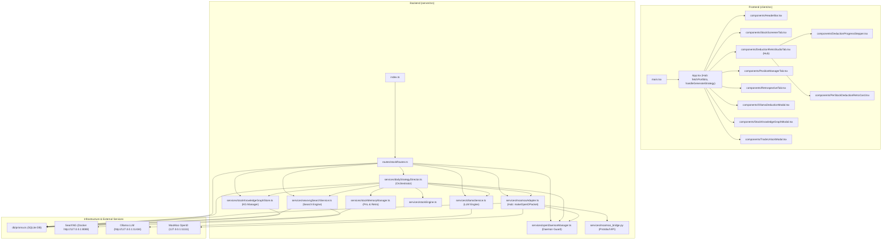

# StockAgent Studio - Intelligent Stock Selection, Deduction & Retrospective Trading System (SPA)

**English** | [中文文档](README_CN.md)

> Full-stack US stock intelligence, deduction, and retrospective trading platform powered by **MooMoo OpenD Native TCP API**, **Local Docker SearXNG Fast Web Search**, and **Hardware-Aware Ollama Local LLMs**.

---

## 🌟 Core Architecture & Key Features

### 1. Unified Deduction & Retrospective Studio (Single-Stock Panoramic View)
- **4 Core Elements per Stock**: Combines forward deduction with historical retrospective trading for each stock in portfolio/watchlist:
  1. 🧠 **Exclusive Stock Knowledge Graph**: Entity nodes (suppliers, competitors, macro trends, sector concepts) and edge relations with interactive visualization and custom node insertion.
  2. 📰 **SearXNG Pre-Market News Catalysts**: Instant pre-market news aggregation via local Docker SearXNG engine.
  3. 💼 **MooMoo Real-Time Positions & Funds**: Live share counts, average cost, current price, unrealized PnL, and position weight.
  4. 🔄 **Past Deduction vs. Actual Price Action Retro**: Compares prior deduction target/stop-loss boundaries against actual price movements to distill disciplined risk management lessons.

### 2. Visual Deduction Pipeline Stepper
- **6-Stage Real-Time Pipeline**:
  - `Step 1`: Fetch live portfolio & watchlist via MooMoo OpenD.
  - `Step 2`: Search pre-market US market news via local SearXNG Docker container.
  - `Step 3`: Load per-stock trading Knowledge Graph.
  - `Step 4`: Reconcile past target/stop-loss prices against actual market retro PnL.
  - `Step 5`: ⚡ **Full Context Fusion Reasoning via Ollama Local LLM**.
  - `Step 6`: Generate precise quantitative position sizing guidance & risk alerts.
- **LLM Context Payload Inspector**: Inspect raw prompt payloads, knowledge graph context, SearXNG news feeds, and raw Ollama JSON responses in real time.

### 3. Hardware-Aware LLM Selector
- **Automatic Hardware Sensing**: Automatically detects GPU VRAM, System RAM, and CPU cores (e.g., `💻 63.8GB RAM | NVIDIA GeForce RTX 4090 (24GB VRAM)`).
- **Smart Model Recommendation**: Evaluates local hardware capacity and financial reasoning benchmarks to suggest optimal local models (e.g., **`⭐ [Recommended] qwen3.6:27b`** 27B parameter structured quantization model).
- **Seamless Model Switching**: Choose from all locally pulled Ollama models via dropdown selector, taking effect on the next deduction run.

### 4. SearXNG Self-Healing & MooMoo OpenD Native Integration
- **SearXNG Health Probe**: Automatically checks local SearXNG (`http://127.0.0.1:8088`) health, self-healing by launching the background Docker container if offline.
- **MooMoo Trade Unlock**: Supports dynamic MD5 password entry for trading authorization, updating UI status to **`Unlocked`** with safety guards to prevent accidental order execution.

---

## 🚀 Quick Start

### 1. Prerequisites
- **Node.js**: `v18+`
- **Docker** (For SearXNG local search container)
- **Ollama**: Running locally at `http://127.0.0.1:11434`
- **MooMoo OpenD**: Running locally at `127.0.0.1:11111`

### 2. Installation & Running

```bash
# Install root, frontend, and backend dependencies
npm install

# Initialize SQLite database schema
npm run db:push

# Start development server (runs backend on 3001 and frontend on 3000 concurrently)
npm run dev
```

Open your browser and navigate to: `http://localhost:3000`

---

## 🛠️ Project Structure

```
StockAgent/
├── client/                     # React + Vite + TailwindCSS SPA frontend
│   ├── src/
│   │   ├── components/         # Studio views and modal components
│   │   └── App.tsx             # State manager and Studio routes
├── server/                     # Node.js + Express + Prisma backend
│   ├── src/
│   │   ├── routes/             # RESTful API endpoints
│   │   └── services/           # MooMoo OpenD, Ollama LLM & SearXNG services
│   └── prisma/                 # SQLite database schema
├── graft/                      # Structured code context graph by Graft (Git Ignored)
├── .gitignore                  # Git ignore rules
└── package.json                # Project dependencies and scripts
```

---

## 🗺️ Code Context Graph by Graft

This project utilizes [NanoNets Graft](https://github.com/NanoNets/Graft) to construct a structured code context graph (`graft/`). Powered by tree-sitter AST analysis, Graft indexes **28 files**, **105 core symbols**, and **235 dependency edges**, enabling AI agents and developers to quickly orient themselves within the codebase.

### 1. Full-Stack Architecture Diagram (Mermaid)



### 2. Key Hubs and Hotspots

Identified by Graft topological analysis:

- **Frontend Entrypoint**: `App.tsx` (`fetchPortfolio`, `fetchRetrospectives`, `handleGenerateStrategy`) dispatches state to tabs and modals.
- **Deduction Orchestration**: `dailyStrategyDirector.ts` (`generateDailyStrategy`) coordinates portfolio fetching, SearXNG search, knowledge graphs, and Ollama context fusion.
- **Quotes & Trading Adapter**: `moomooAdapter.ts` (`makeOpenDPacket`, `parseOpenDPackets`, `queryRealProtobufPortfolio`) handles MooMoo OpenD native TCP packets and Python bridging.
- **Hardware & Search Services**: `ollamaService.ts` (hardware detection & model ranking) and `searxngSearchService.ts` (Docker health probing & pre-market news retrieval).

### 3. Common Graft Commands

```bash
# 1. Rebuild / update the local code context graph (updates graft/ directory)
npx @nanonets/graft build

# 2. Output token-budgeted repository orientation map and key hubs
npx @nanonets/graft map

# 3. Serve an interactive visual interface for the context graph
npx @nanonets/graft viz

# 4. Trace callers and references for a specific symbol
npx @nanonets/graft callers handleGenerateStrategy
```

---

## 📄 License

[MIT License](LICENSE)
