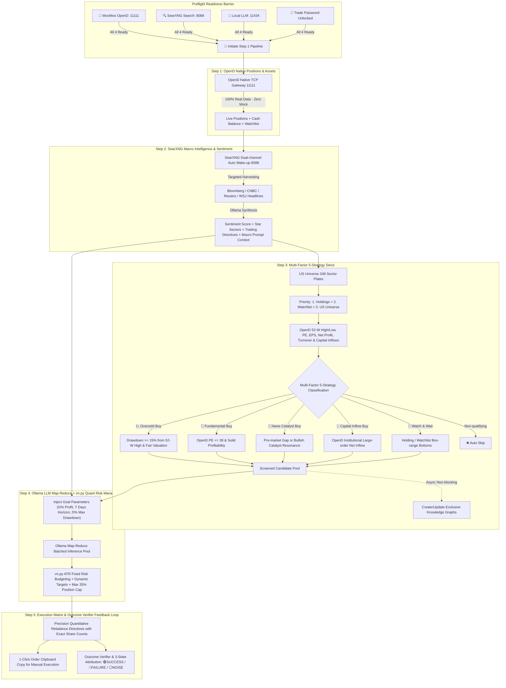

# StockAgent Studio - Intelligent Stock Selection, Deduction & Retrospective Trading System (SPA)

**English** | [中文文档](README_CN.md)

> **Tailored for Working Professionals**: A daily-frequency, goal-oriented swing-trading and retrospective system. Powered by **100% Real-Time MooMoo OpenD Native TCP Data** + **Local Docker/WSL SearXNG Deep Search** + **Hardware-Aware Ollama Local LLMs**, deeply integrating **vn.py's classical quantitative risk control and portfolio management architecture**. **Strictly prohibits automated machine execution**, delivering precision quantitative rebalance directives for manual execution.

---

## 🌟 Core Architecture & Key Flow



---

## 💡 4 Core Quantitative Architecture Pillars Borrowed from vn.py

Tailored for working professionals operating at a daily frequency after work with **strictly zero machine automated orders**, StockAgent incorporates vn.py's core quant architecture:

| Pillar | vn.py Classical Quant Design | StockAgent Implementation & File Location |
| :--- | :--- | :--- |
| **Portfolio Risk & Position Sizing** | `PortfolioStrategy` & `RiskManager` Fixed Risk Budgeting | [`quantRiskManager.ts`](file:///c:/Users/lilin/StockAgent/server/src/services/quantRiskManager.ts): Sizing based on ATR true range and user $G\%$ profit target & $D\%$ max drawdown. Strict $\le 35\%$ single-stock cap. |
| **Outcome Verification & Attribution** | `TradeRecorder` & `PerformanceAnalysis` Performance Attribution | [`deductionVerificationService.ts`](file:///c:/Users/lilin/StockAgent/server/src/services/deductionVerificationService.ts): Point-to-point comparison of past $T$-day advice vs real close prices. Tri-state attribution (`SUCCESS`/`FAILURE`/`RANDOM_NOISE`), automatically feeding lessons learned into future LLM context. |
| **Market Session State Machine** | `TradingCalendar` & `EventEngine` Calendar-driven State Machine | [`marketCalendarService.ts`](file:///c:/Users/lilin/StockAgent/server/src/services/marketCalendarService.ts): Categorizes `PRE_MARKET`, `INTRADAY`, `POST_MARKET`, and `WEEKEND`. Automatically activates post-market retro & next-day deduction after work. |
| **Unified Gateway Adapter** | `BaseGateway` Native Protocol & Contract Abstraction | [`moomooAdapter.ts`](file:///c:/Users/lilin/StockAgent/server/src/services/moomooAdapter.ts): Wraps MooMoo OpenD Protobuf/TCP sockets into clean `PositionData`, `AccountData`, and `QuoteData` contracts. |

---

## 👔 Features Built for Working Professionals

1. **Zero Automated Machine Execution**:
   - Eliminates API slippage, connection dropouts, and catastrophic margin liquidations;
   - Every stock card includes a **"📋 Copy Order Directive"** button, instantly copying `Symbol / Direction / Shares / Limit Price` for quick manual placement in mobile/desktop apps.
2. **Preflight Readiness Barrier**:
   - Enforces strict execution order: Step 1 will only trigger when **OpenD (11111)**, **SearXNG (8088)**, **Ollama Local LLM (11434)**, and **Trade Password Unlock** are all verified green.
3. **Single-Flight Mutex & Throttled Queue**:
   - Server-side single flight prevents duplicate concurrent deduction runs;
   - Ollama inference uses a 2-worker concurrency pool with 60s timeouts, eliminating VRAM saturation and queue timeouts.
4. **Dual-Channel SearXNG Auto Wake-Up (Docker + WSL Daemon)**:
   - Automatically detects and wakes up WSL Ubuntu and Windows Docker engines when offline.
5. **100% Real Data · Zero Hardcoding**:
   - All static mock data, hardcoded stock arrays, and dummy fallback figures (`1000.0`) have been 100% eliminated.

---

## 🚀 Quick Start

### 1. Prerequisites
- **Node.js**: `v18+`
- **Docker** or **WSL2** (For SearXNG local search container)
- **Ollama**: Running locally at `http://127.0.0.1:11434` (Qwen 3.8 / Qwen 3.6 / Gemma 4 recommended)
- **MooMoo OpenD**: Running locally at `127.0.0.1:11111`
- **Python**: `3.9+` with `moomoo-api` installed (`pip install moomoo-api`)

### 2. Installation & Running

```bash
# 1. Install root, frontend, and backend dependencies
npm install

# 2. Initialize SQLite database schema
npm run db:push

# 3. Start development servers (runs backend on 3001 and frontend on 3000 concurrently)
npm run dev
```

Open your browser and navigate to: **`http://localhost:3000`**

---

## 🛠️ Project Structure

```
StockAgent/
├── client/                     # React + Vite + TailwindCSS SPA frontend
│   ├── src/
│   │   ├── components/         # Studio views, Stepper, Per-Stock Cards, Deduction Modals
│   │   └── App.tsx             # State manager, Preflight barrier, and Studio routes
├── server/                     # Node.js + Express + Prisma backend
│   ├── src/
│   │   ├── routes/             # RESTful API endpoints (/api/stock/...)
│   │   ├── services/           # Quant Risk Manager, Goal Engine, OpenD Adapter, Ollama, SearXNG
│   │   └── types/              # 5-strategy types, quant parameters, and pipeline stages
│   └── prisma/                 # SQLite database schema
├── graft/                      # Structured code context graph by Graft (Git Ignored)
├── .gitignore                  # Git ignore rules
└── package.json                # Project dependencies and scripts
```

---

## 📄 License

[MIT License](LICENSE)
