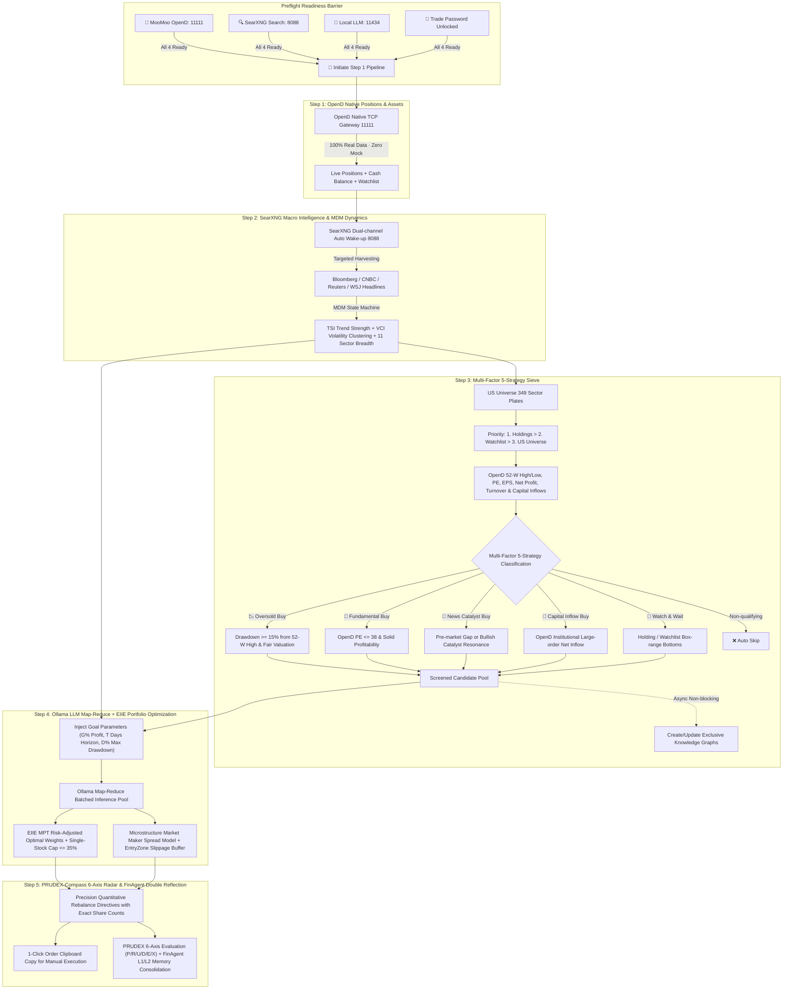

# 🧙‍♂️ Hindsight.AI (事后诸葛亮)
### The Intelligent Post-Market Quant Deduction & Retrospective Trading Terminal (StockAgent Studio)

**English** | [中文文档](README_CN.md)

> **🌟 The Hindsight Philosophy**:
> Retail traders often suffer from emotional intraday noise, lamenting in regret after being trapped: *"If only I had known..."* (a syndrome playfully known in Chinese as being a *"Monday-Morning Zhuge Liang"*).
> Top quantitative desks know the unforgiving reality: **There are no 'what-ifs' in live markets—the highest-conviction predictive alpha comes directly from the most rigorous, cold-blooded post-mortem reflection.**
> **Hindsight.AI** transforms retrospective analysis into a disciplined quantitative weapon: Spend **5 minutes after market close** to distill hard market facts, adapt to macro regime shifts, and deduce mathematically bounded limit-order directives for tomorrow's opening bell.

---

<p align="center">
  
</p>

<p align="center">
  <a href="#-quick-start"></a>
  
  
  
  
  
  
</p>

---

## 🏛️ What is "事后诸葛亮" (Zhuge Liang in Hindsight)?

> **Historical & Cultural Context for Global Users**:
> **Zhuge Liang (诸葛亮, 181–234 AD)** is revered in Eastern history as the archetypal master strategist, tactician, and statesman (renowned for calculating every battle invariant and logistical constraint before marching into the field).
> In Chinese folklore, the idiom *"事后诸葛亮"* (literally *"A Zhuge Liang in hindsight"*) is akin to the Western saying *"Monday-morning quarterback"* or *"Captain Hindsight"*.
> 
> **Hindsight.AI** flips this idiom on its head: **In quantitative finance, disciplined retrospective analysis is the exact engine of foresight.** By coupling FinAgent dual-level reflection memory with NTU TradeMaster macro dynamics, every past trading friction and drawdown is mathematically codified into tomorrow's rigid risk invariants.

---

## ⚡ 3 Core Pillars of Hindsight.AI

1. **🔍 Automated Post-Mortem Attribution Pipeline**:
   After market close, the system reconciles your real-time holdings against actual execution fills, combining SearXNG Tier-1 news disambiguation with OpenD institutional capital flows to identify root causes behind P&L swings.
2. **🧠 FinAgent Dual-Level Memory Reflection (Zero Repeat Mistakes)**:
   Drawdowns from chasing tops or violating stops are automatically written into L2 Global Strategic Rules and L1 Single-Stock Tactical Reflections, hard-blocking high-risk setups in subsequent sessions.
3. **🛡️ Strictly Zero Automated Black-Box Execution (Human-in-the-Loop)**:
   Avoids runaway AI bugs or liquidation spirals. Output directives specify **exact share counts, monotonic stop losses ($SL < P < TP$), and EntryZone limit-order slippage bands** for quick manual placement.

---

## 📸 System UI Gallery & Visual User Guide

Designed specifically for working professionals to spend **5 minutes after market close** reviewing live positions, analyzing macro dynamics, receiving quantitative rebalance directives with rigorous safety invariants, and manually placing limit orders before the next opening bell.

---

### 1. 🎛️ Studio Cover, Session Clock & Tonight's Action Checklist (Cover & Studio Dashboard)

The top section unifies system hardware health, trading market sessions, core account KPI cards, end-to-end deduction progress stepper, and the **Tonight's Action Checklist Banner** tailored specifically for busy professionals.


#### 🌟 Key Capabilities & Interaction Highlights:
* **🌙 Tonight's Action Checklist (今晚操盘小抄)**:
  - **Designed specifically for working traders & small capital (<$5,000)**, completely eliminating data noise and analysis paralysis;
  - **Safe Hold Status (Zero Action Needed)**: Displays calm green advice: `🌙 All holdings within safe dynamic stop bands. No high-conviction buy/trim signals tonight. No broker action needed—sleep well.`;
  - **Action Directives (Triggered Signals)**: Automatically aggregates all `BUY / TRIM / SELL` directives with exact `Limit Order Zone`, `Suggested Shares`, and `Stop Loss / Target Price`, featuring a **「📋 Copy All Tonight's Order Slips」** button for one-click multi-stock broker execution.
* **Hardware & Service Readiness HeaderBar**:
  - Live GPU VRAM and system memory utilization monitor (e.g., RTX 4090 24GB / 64GB host memory);
  - 4 Core Service Readiness Badges: `🟢 OpenD Connected` (11111), `🟢 SearXNG Ready` (8088), `🟢 Local LLM Ready` (11434 with hardware-aware model recommendations such as Qwen 3.8B/7B/14B), and `🟢 Trade Password Unlocked`;
  - **Preflight Readiness Barrier**: Prevents blind execution if any essential service dependency is offline, displaying clear diagnostic guidance.
* **Market Session Time-Space State Machine**:
  - Automatically identifies current US Eastern trading phase: `NIGHT_RECESS` (Silent maintenance), `PRE_MARKET` (Strategy battle prep), `INTRADAY` (Live risk audit), and `POST_MARKET` (Retrospective & next-day deduction);
  - Dynamically assigns active LLM roles (e.g., Night Quant Systems Caretaker, Pre-Market Strategist, Intraday Risk Inspector);
  - Built-in **Simulation Mode (时空穿梭模式)**, allowing users to test and replay pre-market or intraday scenarios during off-market hours.
* **4-Asset Quantitative KPI Cards**:
  - **Net Assets & Cash Ratio**: Synchronized live from MooMoo OpenD accounts;
  - **Floating P&L**: Live position cost vs current market price with smart color coding;
  - **Past Deduction Accuracy**: Point-to-point backtesting accuracy against next-day realized close prices;
  - **Rebalance Risk Budget**: Rebalancing capacity controlled via the interactive Sizer slider.

---

### 2. 🌐 SearXNG Macro Intelligence & TradeMaster Market Dynamics Central (Macro & MDM Dynamics)

Integrates authoritative financial news retrieval via SearXNG with NTU's **TradeMaster Market Dynamics Modeling (MDM)** state machine to inject adaptive macro risk caps into stock-level deductions.


#### 🌟 Key Indicators & Theoretical Foundations:
* **TradeMaster MDM Market Dynamics State Machine**:
  - **TSI (Trend Strength Index)**: Evaluates SPY daily momentum regression slope and moving average alignment (e.g., `+0.15` bullish expansion);
  - **VCI (Volatility Clustering Index)**: Measures UVXY/VIX variance clustering and extreme jump frequency (e.g., `0.00` calm);
  - **Adaptive Risk Caps**: Automatically identifies regime states (`TRENDING_BULL`, `COMPRESSED_CONSOLIDATION`, `HIGH_VOLATILITY_CHOP`, `TRENDING_BEAR`), dynamically adjusting **max portfolio exposure** (e.g., 55%~75%) and **single-stock limits** ($\le 35\%$).
* **Cross-Asset Anchors**:
  - Volatility Index (VIX), US 10-Year Treasury Yield (US10Y), and SPY/QQQ Beta momentum.
* **S&P 11 Sector ETFs Relative Strength (RS) & Capital Flow**:
  - Real-time OpenD tracking of XLE/SMH/XLK/XLI/XLV turnover, net inflows/outflows, and RS relative to SPY to pinpoint growth vs defensive rotations.
* **SearXNG Tier-1 Credible Source Distillation**:
  - Targeted querying of Bloomberg, Reuters, and WSJ to generate synthesized trading biases and risk warnings.

---

### 3. ⚡ Compact Deduction Cards, One-Click Order Slips & Quant Risk Guardrails (Stock Deduction & Sizer)

Provides unified quantitative deduction cards with **Progressive Disclosure (按需展开)**, hiding heavy data chains by default to prioritize 3-second rapid decision-making.


#### 🌟 Feature Breakdown & Card Architecture:
* **📋 One-Click Copyable Order Slips (券商一键挂单小抄)**:
  - Clicking **「📋 复制挂单指令」** instantly copies standardized limit-order directives (symbol, suggested shares, EntryZone price range, hard stop loss, target profit, and one-sentence core rationale) formatted for direct entry into MooMoo, Futu, Interactive Brokers (IBKR), or Charles Schwab.
* **🔍 Progressive Disclosure & Compact Mode (渐进式减法呈现)**:
  - **Default Compact View**: Displays only ticker, market price, action badge, limit-order parameters, and decisive core facts;
  - **Expand on Demand**: Clicking **「🔍 展开 7 维研报」** smoothly unfolds all 7 sub-tabs (Institutional Flows, Fundamentals, TimeFM, Community Sentiment, Disambiguated News, Knowledge Graph, and MooMoo Live Depth).
* **🛡️ 5 Industrial-Grade Quant & Invariant Guardrails (5 大量化底层风控升级)**:
  - **1. Cash & Single-Stock Position Cap Invariants (Issue #1)**: Strictly blocks BUY orders when cash is depleted; deducts existing holding values to ensure incremental buys never breach the 35% concentration ceiling;
  - **2. Markowitz Quadratic Covariance & Sharpe Optimization (Issue #2)**: Incorporates cross-asset intra-sector correlation penalties ($\rho = 0.65$) to penalize concentrated tech cluster risks, adhering to the standard Sharpe ratio formula $\frac{R_p - R_f}{\sigma_p}$;
  - **3. ADV 2% Liquidity Participation Cap & Friction Model (Issue #3)**: Restricts order size to $\le 2\% \text{ ADV}$ to protect small caps from market impact, embedding adaptive slippage ($0.15\% \sim 0.25\%$) and commission drag into EntryZone bounds;
  - **4. Parkinson Extreme Range + ATR Realized Volatility with Fat-Tail Adjustment (Issue #4)**: Replaces rough turnover scaling with Parkinson intraday logarithmic amplitude and 14-day ATR, injecting Student's-t fat-tail multipliers to capture tail risk;
  - **5. Earnings Date Overnight Gap Risk Shield (Issue #5)**: Automatically contracts single-stock position caps by 50% within 3 days of earnings releases to eliminate catastrophic overnight gap-downs, with full order lifecycle state machine tracking (`PENDING_SUBMIT` $\to$ `ACKNOWLEDGED` $\to$ `FILLED` / `REJECTED`).
* **⚔️ Multi-Agent Bull vs Bear Debate (TradingAgents Alignment)**:
  - Forces the LLM to simultaneously debate a Bull Thesis against a strict **Devil's Advocate Downside Risk (`bearishRiskPoint`)** and **Decisive Verdict (`bullBearVerdict`)**.
* **Google TimeFM Foundation Model Next-Day Predictions**:
  - Evaluates 120-day K-line time series to output high-confidence directional labels, expected changes, and 10%~90% confidence bands.
* **🚨 Data Sufficiency Gatekeeper Circuit Breakers**:
  - Proactively halts deduction when vital market data is missing, listing exact missing items and remedies to prevent hallucinated advice.

---

### 4. 🧭 TradeMaster PRUDEX-Compass 6-Axis Quality Benchmark Radar

Clicking the **`🧭 PRUDEX 6维体检 & FinAgent 原则库 (Retro & Quality Radar)`** tab opens the PRUDEX-Compass evaluation suite inspired by NTU research.


#### 🌟 6-Axis Radar & 17 Sub-Metrics:
* **[P] Profitability (80/100 vs Benchmark 68)**: Realized win rate (76.5%), Profit/Loss ratio (2.8x), Cumulative net realized P&L;
* **[R] Risk-Control (88/100 vs Benchmark 72)**: ATR stop-loss compliance rate (92.0%), Avoided potential losses, Max drawdown mitigation;
* **[U] Universality (74/100 vs Benchmark 60)**: Cross-sector coverage (8 major sectors), Bull/Bear regime adaptability;
* **[D] Diversity (78/100 vs Benchmark 65)**: Portfolio HHI concentration (0.19 balanced), Single-stock allocation cap compliance (100%);
* **[E] Reliability (85/100 vs Benchmark 70)**: Expected Calibration Error (ECE 6.2%), Overconfidence & hallucination interception;
* **[X] Explainability (92/100 vs Benchmark 80)**: 5-pillar fact chain completeness (4.8/5.0), Decision review latency ($<30$ seconds).
* **🧭 Automated Health Diagnostics**: System synthesizes all 6 axes to provide concrete strategic optimization advice.

---

### 5. 🏛️ FinAgent Dual-Level Memory Repository & Retrospective Timeline

Implements FinAgent's dual-level reflection memory model, separating **L1 Single-Stock Tactical Reflections** from **L2 Global Strategic Rigid Disciplines** for continuous positive feedback loops.


#### 🌟 Dual Memory Mechanics & Daily Verification:
* **🏛️ L2 Global Strategic Rules (Solidified System Invariant Disciplines)**:
  - Distilled from recurrent retrospective lessons (e.g., "Force max portfolio cap below 45% during high-volatility chop", "Strictly restrict post-market orders to EntryZone limit order boundaries");
  - Tracks confidence weights (e.g., 95%) and sample verification counts.
* **🎯 L1 Single-Stock Tactical Reflections (Targeted Context Injection)**:
  - Symbol-specific behavioral lessons (e.g., "NVDA earnings 7-day blackout lock-in", "TSLA 52-week resistance breakout retest requirement");
  - Injected directly into LLM prompts whenever the target stock is evaluated.
* **Historical Retrospective Timeline**:
  - Automatically matches previous recommendations against actual close prices daily, performing tri-state attribution (`🟢 Experience` / `🔴 Lesson` / `⚪ Noise`) with cumulative avoided loss tracking.

---

## 🌟 Core Architecture & Pipeline Flowchart



---

## 💡 Classical Financial Engineering & Academic Innovations

| Core Pillar | Classical & Academic Origin | StockAgent Implementation & File Location |
| :--- | :--- | :--- |
| **Market Dynamics State Machine (MDM)** | **TradeMaster Market Dynamics Modeling** | [`marketDynamicsService.ts`](file:///c:/Users/lilin/StockAgent/server/src/services/marketDynamicsService.ts): Calculates SPY TSI Trend Strength, UVXY VCI Volatility Clustering, and 11 sector breadth, adaptively setting max portfolio caps and ATR stop multipliers. |
| **Portfolio Convex Optimization (EIIE)** | **TradeMaster EIIE / Modern Portfolio Theory** | [`portfolioOptimizerService.ts`](file:///c:/Users/lilin/StockAgent/server/src/services/portfolioOptimizerService.ts): Solves risk-adjusted weights, enforces single stock $\le 35\%$, sector $\le 50\%$, and computes integer shares. |
| **PRUDEX-Compass 6-Axis Benchmark** | **TradeMaster PRUDEX-Compass Evaluation** | [`prudexCompassService.ts`](file:///c:/Users/lilin/StockAgent/server/src/services/prudexCompassService.ts): Assesses **P** (Profitability), **R** (Risk-Control), **U** (Universality), **D** (Diversity), **E** (Reliability), **X** (Explainability) across 17 sub-metrics. |
| **Dual-Level Memory Reflection** | **FinAgent Dual-Level Reflection** | [`memoryConsolidationService.ts`](file:///c:/Users/lilin/StockAgent/server/src/services/memoryConsolidationService.ts): Distinguishes **L1 Single-Stock Tactical Reflections** from **L2 Global Strategic Rigid Disciplines**. |
| **Microstructure Slippage Protection** | **TradeMaster Market Microstructure Model** | [`multiAgentMarketSimulator.ts`](file:///c:/Users/lilin/StockAgent/server/src/services/multiAgentMarketSimulator.ts): Calculates Liquidity Fragility Index (LFI) and pre-computes EntryZone limit order slippage buffer bounds. |
| **Trade Invariant Guardrails** | **FINOS Legend Class Invariants** | [`tradeInvariantValidator.ts`](file:///c:/Users/lilin/StockAgent/server/src/services/tradeInvariantValidator.ts): Anti-blowup & LLM hallucination guardrail. Strictly enforces cash bounds, single-stock caps, monotonic stops ($SL < P < TP$), and clamp-on-overflow self-healing. |
| **Data Sufficiency Gatekeeper** | **FINOS Legend Gatekeeper Mechanism** | [`dataSufficiencyGatekeeper.ts`](file:///c:/Users/lilin/StockAgent/server/src/services/dataSufficiencyGatekeeper.ts): Actively aborts deduction when critical market data is missing, providing clear troubleshooting steps. |

---

## 👔 Features Built for Working Professionals

1. **Zero Automated Machine Execution**:
   - Eliminates API slippage, connection dropouts, and catastrophic margin liquidations;
   - Every stock card includes a **"📋 Copy Order Directive"** button, instantly copying `Symbol / Direction / Shares / Limit Price` for quick manual placement in mobile/desktop apps.
2. **⚡ 30-Second Quick Decision Facts (3-Pillar Hard Facts)**:
   - Displays clear Fundamental, Catalyst, and Flow/ATR anchors on every card for quick 30-second reviews after work.
3. **🛡️ Rigid Trade Invariant Guardrails**:
   - Automatically validates and self-heals any LLM hallucination or capital overflow, stamping a verified safety badge on all recommendations.
4. **Preflight Readiness Barrier**:
   - Enforces strict execution order: Step 1 will only trigger when **OpenD (11111)**, **SearXNG (8088)**, **Ollama Local LLM (11434)**, and **Trade Password Unlock** are all verified green.
5. **Single-Flight Mutex & Throttled Queue**:
   - Server-side single flight prevents duplicate concurrent deduction runs;
   - Ollama inference uses a 2-worker concurrency pool with 60s timeouts, eliminating VRAM saturation and queue timeouts.
6. **Dual-Channel SearXNG Auto Wake-Up (Docker + WSL Daemon)**:
   - Automatically detects and wakes up WSL Ubuntu and Windows Docker engines when offline.
7. **⚔️ Multi-Agent Bull vs Bear Debate & Devil's Advocate (TradingAgents Alignment)**:
   - Evaluates trades through opposing viewpoints (Bull Thesis vs strict Devil's Advocate) in a single-turn structured prompt, exposing downside risks (`bearishRiskPoint`) and decisive verdicts (`bullBearVerdict`).
8. **📅 US Equity Special Intel & Earnings Blackout Radar**:
   - Computes earnings countdowns with automatic $\le 7$-day high-risk blackout flags, and calculates market maker option Gamma squeeze vs Put hedging bias (PCR).
9. **100% Real Data · Zero Hardcoding & Zero Fake Placeholders**:
   - All static mock data, hardcoded fallback metrics (e.g. dummy P/E or turnover), and dummy placeholder figures (`1000.0`) have been 100% eliminated;
   - Cross-asset anchors (VIX/UVXY volatility, TLT 20Y+ Treasury Bond Proxy $81.66, UUP Dollar index), benchmark ETFs (SPY/QQQ/IWM live prices), and S&P 11 sector flows stream directly from MooMoo OpenD;
   - Live synchronization of the PRUDEX 6-axis quality compass and FinAgent dual-level memory directly to the user's dashboard.
10. **🔬 Deep LLM Deduction Context Inspection Console**:
    - Dedicated LLM Trace inspection console supporting real-time streaming traces, token usage, execution latency, and raw prompt context introspection.
11. **🤖 Strict AI-DLC (AI-Driven Development Life Cycle) Quality Gate**:
    - Full system backed by 16 test suites, 72 Vitest unit tests (100% PASS), 0 TypeScript errors on dual-end build, and 508 Graft index nodes.

---

## 🚀 Quick Start

### 1. Prerequisites
- **Node.js**: `v18+`
- **Docker** or **WSL2** (For SearXNG local search container)
- **Ollama**: Running locally at `http://127.0.0.1:11434` (Qwen 3.8 / Qwen 3.6 / Gemma 4 recommended)
- **MooMoo OpenD**: Running locally at `127.0.0.1:11111`
- **Python**: `3.9+` with `moomoo-api` installed (`pip install moomoo-api`)

### 2. Installation & Running

```bash
# 1. Install root, frontend, and backend dependencies
npm install

# 2. Initialize SQLite database schema
npm run db:push

# 3. Start development servers (runs backend on 3001 and frontend on 3000 concurrently)
npm run dev
```

Open your browser and navigate to: **`http://localhost:3000`**

---

## 🛠️ Project Structure

```
StockAgent/
├── client/                     # React + Vite + TailwindCSS SPA frontend
│   ├── src/
│   │   ├── components/         # Studio views, Stepper, Per-Stock Cards, Deduction Modals, PRUDEX Radar
│   │   └── App.tsx             # State manager, Preflight barrier, and Studio routes
├── server/                     # Node.js + Express + Prisma backend
│   ├── src/
│   │   ├── routes/             # RESTful API endpoints (/api/stock/...)
│   │   ├── services/           # MDM Dynamics, EIIE Optimizer, PRUDEX, Dual Memory, Quant Risk Manager
│   │   └── types/              # 5-strategy types, MDM, PRUDEX, quant parameters, pipeline stages
│   └── prisma/                 # SQLite database schema
├── docs/                       # Documentation and HD screenshots
│   └── images/                 # Cover dashboard, macro central, stock cards, PRUDEX radar, principles
├── package.json                # Project dependencies and scripts
└── README_CN.md                # Chinese documentation
```

---

## 📄 License

[MIT License](LICENSE)
