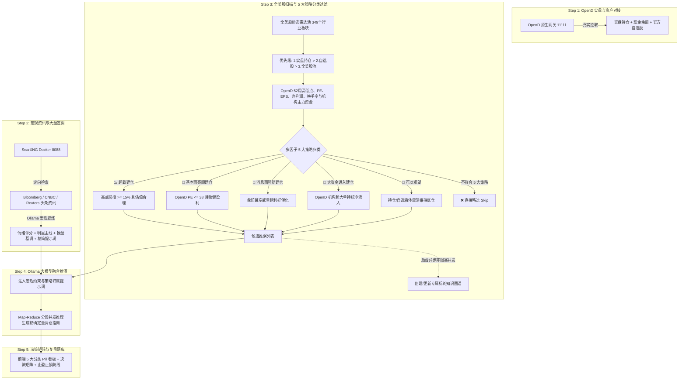

# StockAgent Studio - 智能选股、推演与复盘操盘系统 (SPA)

[English Version](README.md) | **中文文档**

> 基于 **100% 真实 MooMoo OpenD 原生 TCP 数据** + **本地 Docker SearXNG 极速全网搜索 (Bloomberg/CNBC/Reuters)** + **硬件自适应 Ollama 本地大模型** 的全栈美股智能选股、5 大策略多维推演与复盘操盘系统。

---

## 🌟 核心架构与系统全景



---

### 1. 100% 真实 OpenD 官方数据源 & 彻底零硬编码 (Zero-Hardcoding)
- **剔除所有静态硬编码**：彻底删除了所有静态写死的股票列表与默认兜底数字（如 `100.0`, `1000.0`）。
- **动态全量美股与板块池**：通过 OpenD SDK (`get_user_security`, `get_plate_stock`, `get_stock_basicinfo`) 动态拉取全量美股代码与 349 个官方行业板块。
- **深度估值与主力资金流**：所有股价、52 周高低点、市盈率 PE/PE TTM、市净率 PB、每股收益 EPS、净利润、换手率以及机构主力资金流向 (`main_in_flow`, `in_flow`) 均直连 OpenD 获取。

---

### 2. 全美股多因子 5 大策略分类引擎
严格将候选标的归类至 5 大明确策略，不符合者自动跳过：
1. 📉 **超跌建仓 (`OVERSOLD_BUY`)**：距离 52 周高点深度回撤 ≥ 15%，且 PE 估值健康未泡沫化，属于高盈亏比反弹/反转机会。
2. 💎 **基本面亮眼建仓 (`FUNDAMENTAL_BUY`)**：OpenD 官方 PE ≤ 38 且 EPS > 0，盈利能力稳健。
3. 🚀 **消息面强劲建仓 (`NEWS_CATALYST_BUY`)**：SearXNG 舆情与新闻强催化，或盘前跳空 ≥ 1.5%。
4. 🏦 **近期大资金进入建仓 (`CAPITAL_INFLOW_BUY`)**：OpenD 机构超大单主力持续净流入。
5. 👀 **可以观望 (`WATCH_AND_WAIT`)**：持仓或关注标的处于正常箱体震荡区间，维持现有底仓跟踪。
- **自动略过 (Skip)**：任何不属于以上 5 类的标的直接被略过，不浪费大模型算力。
- **严格优先级**：实盘持仓 (P1) > 个人自选股 (P2) > 全美股雷达池 (P3)。

---

### 3. 后台异步非阻塞操盘知识图谱更新
- **非阻塞并发**：当标的通过多因子初筛进入候选推演列表后，系统利用 `setImmediate` 在后台以非阻塞方式异步创建或更新其专属知识图谱；
- **智能装载节点**：自动将最新催化剂新闻、5 大策略归属理由与机构资金流向更新至标的图谱中，主推演流程毫秒级流畅运行。

---

### 4. SearXNG 全网宏观大盘动态与消息面全景
- **定向权威财经源检索**：直接抓取 Bloomberg、CNBC、Reuters 等权威媒体的大盘走势与盘前异动。
- **情绪定调徽章与明星主线**：自动计算市场情绪分值（如多头顺势、防守避险、震荡分化），并高亮算力芯片、电力能源、防御性消费等明星主线。
- **操盘总纲与提示词提炼**：生成今日策略基调、仓位调控与风险防范要求，并自动提炼为 Prompt 上下文注入下游个股推演。

---

### 5. 5 步流水线与前端 UI 毫秒级三态严密同步
- **可视化动态步进器 (`DeductionProgressStepper`)**：
  - `Step 1`: **OpenD 持仓与资产连通**
  - `Step 2`: **SearXNG 全网宏观与明星板块搜刮**
  - `Step 3`: **候选池构建与标的多维挖掘 (5大策略分类)**
  - `Step 4`: **Ollama 大模型融合推演 (Map-Reduce)**
  - `Step 5`: **精确定量指南生成与策略复盘落库**
- **三态精准联动遮罩 (`StepSyncOverlay`)**：
  - ⚡ **`ACTIVE`（正在执行）**：呼吸光边框、动态 Spinner，实时展示底层处理明细。
  - ⏳ **`PENDING`（排队等待）**：优雅低透明度毛玻璃，明确提示 `⏳ 阶段排队中 · 等待 Step N 完成后自动解锁`。
  - ✓ **`DONE`（已完成）**：立即解除遮罩，清晰呈现最新计算结果。

---

### 6. 硬件自适应与 Ollama 大模型算力调度
- **硬件参数自动感知**：自动识别显卡显存 (VRAM)、系统内存 (RAM) 与 CPU 核心数（如 `💻 63.8GB RAM | NVIDIA GeForce RTX 4090 (24GB VRAM)`）。
- **智能推荐算力契合模型**：根据硬件容量与金融推理能力综合评分，自动推荐最佳模型（如 **`⭐ [硬件推荐] qwen3.6:27b`**）。
- **Map-Reduce 分段并发推理**：针对多标的并行推演，生成包含买卖股数、现价、目标价、止损线与风控理由的完整结构化指南。

---

## 🚀 快速开始 (Quick Start)

### 1. 环境准备
- **Node.js**: `v18+`
- **Docker** (用于 SearXNG 本地搜索容器)
- **Ollama**: 本地运行 `http://127.0.0.1:11434`
- **MooMoo OpenD**: 本地运行 `127.0.0.1:11111`
- **Python**: `3.9+` 并安装 `pip install moomoo-api`

### 2. 安装与运行

```bash
# 1. 安装根目录及前后端依赖
npm install

# 2. 初始化 SQLite 数据库 Schema
npm run db:push

# 3. 启动开发服务器 (同时拉起后端 3001 与前端 3000)
npm run dev
```

打开浏览器访问：`http://localhost:3000`

---

## 🛠️ 项目结构 (Project Structure)

```
StockAgent/
├── client/                     # React + Vite + TailwindCSS SPA 前端
│   ├── src/
│   │   ├── components/         # Studio 视图、步进器、5-in-1 卡片与同步遮罩
│   │   └── App.tsx             # 状态驱动与 Studio 路由
├── server/                     # Node.js + Express + Prisma 后端
│   ├── src/
│   │   ├── routes/             # RESTful API 路由 (/api/stock/...)
│   │   ├── services/           # OpenD 适配器、Ollama 服务、SearXNG 搜索、知识图谱
│   │   └── types/              # 5 大策略分类与阶段类型定义
│   └── prisma/                 # SQLite 数据库 Schema
├── graft/                      # Graft 自动生成的代码上下文图谱 (Git Ignored)
├── .gitignore                  # Git 排除规则
└── package.json                # 项目依赖与脚本
```

---

## 🗺️ Graft 代码图谱与架构图 (Code Context Graph by Graft)

本项目基于 [NanoNets Graft](https://github.com/NanoNets/Graft) 构建了结构化的代码上下文图谱 (`graft/`)。

```bash
# 1. 重构/更新本地代码上下文图谱 (更新 graft/ 目录)
npx @nanonets/graft build

# 2. 输出仓库模块分布与核心 Hub 节点
npx @nanonets/graft map
```

---

## 📄 License

[MIT License](LICENSE)
