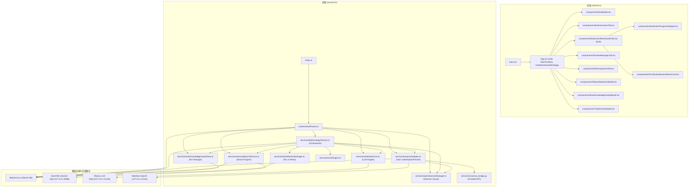

# StockAgent Studio - 智能选股与推演复盘操盘系统 (SPA)

[English Version](README.md) | **中文文档**

> 基于 **MooMoo OpenD 原生 TCP API** + **本地 Docker SearXNG 极速全网搜索** + **硬件自适应 Ollama 本地大模型** 的全栈美股智能选股、推演与复盘操盘系统。

---

## 🌟 核心架构与特色功能

### 1. 【推演与复盘 Studio】单标的全景融合 (Unified Deduction & Retrospective Studio)
- **单股票 4 大核心推演要素**：将推演与复盘有机融合，为持仓/关注列表中每只股票构建包含四大视角的完整推理链卡片：
  1. 🧠 **单股票专属操盘知识图谱 (Knowledge Graph)**：实体节点（供应商/竞品/宏观/概念）与关联边，支持互动图谱可视化与自定义节点添加。
  2. 📰 **SearXNG 盘前新闻催化剂 (Live News)**：从本地 Docker SearXNG 搜索引擎极速检索盘前全网资讯。
  3. 💼 **MooMoo 实盘持仓与资金 (Positions & Funds)**：股数、成本价、现价、浮动盈亏与仓位占比。
  4. 🔄 **前次推演与走势复盘 (Past Deduction vs. Actual Price Action Retro)**：对比上一交易日推演建议（目标价/止损线）与实际盘面走势，自动蒸馏风控教训纪律。

### 2. 推演全流程可视化与动态步进器 (Visual Deduction Pipeline Stepper)
- **6 大阶段实时动态步进器**：
  - `Step 1`: MooMoo OpenD 抓取实盘持仓与自选股
  - `Step 2`: SearXNG 本地 Docker 检索美股盘前全网资讯
  - `Step 3`: 装载单股票操盘知识图谱
  - `Step 4`: 对齐前次推演目标价/止损线与盘面走势复盘
  - `Step 5`: ⚡ **Ollama 本地 LLM 大模型全量 Context 融合推理**
  - `Step 6`: 生成精确定量加减仓指南与风控预警
- **LLM Context 上下文检视器 (Payload Inspector)**：实时查看输入给 Ollama 的全量 Prompt Payload、知识图谱 Context、SearXNG 资讯与 Ollama 原始 JSON 输出。

### 3. 硬件自适应与 Ollama 模型智能推荐 (Hardware-Aware LLM Selector)
- **硬件参数自动感知 (Hardware-Aware Badge)**：自动识别本机 GPU 显存 (VRAM)、系统总内存 (RAM) 与 CPU 核心数（如 `💻 63.8GB RAM | NVIDIA GeForce RTX 4090 (24GB VRAM)`）。
- **智能推荐算力契合模型**：根据硬件容量与金融推理能力综合评分，自动推荐最佳模型（如 **`⭐ [硬件推荐] qwen3.6:27b`** 27B 参数结构化量化模型）。
- **无缝模型切换**：下拉菜单中保留所有已安装的 Ollama 本地模型，更改模型选择在下一次推演时生效。

### 4. SearXNG 自动自愈与 MooMoo OpenD 原生集成
- **SearXNG 探针与自动拉起**：检测本地 SearXNG (`http://127.0.0.1:8088`) 状态，若未运行自动以后台 Docker 容器拉起。
- **MooMoo 交易密码安全解锁**：支持输入动态交易密码（MD5）解锁交易权限，解锁后右上角显示 **`已解锁`** 状态并开启安全禁用防误触。

---

## 🚀 快速开始 (Quick Start)

### 1. 环境准备
- **Node.js**: `v18+`
- **Docker** (用于 SearXNG 本地搜索容器)
- **Ollama**: 本地运行 `http://127.0.0.1:11434`
- **MooMoo OpenD**: 本地运行 `127.0.0.1:11111`

### 2. 安装与运行

```bash
# 安装根目录及前后端依赖
npm install

# 初始化 SQLite 数据库 Schema
npm run db:push

# 启动开发服务器 (同时拉起后端 3001 与前端 3000)
npm run dev
```

打开浏览器访问：`http://localhost:3000`

---

## 🛠️ 项目结构 (Project Structure)

```
StockAgent/
├── client/                     # React + Vite + TailwindCSS 极简 UI 前端
│   ├── src/
│   │   ├── components/         # 核心 Studio 视图与 Modal 组件
│   │   └── App.tsx             # 状态驱动与 Studio 路由
├── server/                     # Node.js + Express + Prisma 后端
│   ├── src/
│   │   ├── routes/             # RESTful API 路由
│   │   └── services/           # MooMoo OpenD, Ollama LLM & SearXNG 服务
│   └── prisma/                 # SQLite 数据库 Schema
├── graft/                      # Graft 自动生成的代码上下文图谱 (Git Ignored)
├── .gitignore                  # Git 排除规则
└── package.json                # 项目依赖与脚本
```

---

## 🗺️ Graft 代码图谱与架构图 (Code Context Graph by Graft)

本项目基于 [NanoNets Graft](https://github.com/NanoNets/Graft) 构建了结构化的代码上下文图谱 (`graft/`)。通过静态语法解析（Tree-sitter），建立了涵盖 **28 个文件**、**105 个核心 Symbol** 以及 **235 条依赖/调用边 (Edges)** 的精准关联图谱，助力 AI 开发者与 Agent 秒级理解系统全貌。

### 1. 全栈架构与依赖图 (Mermaid Architecture Graph)



### 2. Graft 核心 Hubs 与 Hotspots 节点

基于 Graft 拓扑分析提取的系统核心 Hubs 与 Hotspots 节点：

- 核心 Hotspot **前端入口**：`App.tsx` (`fetchPortfolio`, `fetchRetrospectives`, `handleGenerateStrategy`) 调度全部前端 Tab 与 Modals。
- 核心 Hotspot **推演编排**：`dailyStrategyDirector.ts` (`generateDailyStrategy`) 串联持仓抓取、SearXNG 搜索、操盘知识图谱与 Ollama 融合推理。
- 核心 Hotspot **行情与交易**：`moomooAdapter.ts` (`makeOpenDPacket`, `parseOpenDPackets`, `queryRealProtobufPortfolio`) 处理 MooMoo OpenD 原生 TCP 通信与 Python 桥接。
- 核心 Hotspot **算力与搜索**：`ollamaService.ts`（硬件感知与 LLM 评分推荐）与 `searxngSearchService.ts`（Docker 探针与盘前新闻检索）。

### 3. Graft 常用指令

```bash
# 1. 重新构建/更新本地代码图谱 (自动生成并更新 graft/ 目录)
npx @nanonets/graft build

# 2. 输出轻量化 repo 概览图谱与热门 hubs
npx @nanonets/graft map

# 3. 启动 Graft 交互式可视化网页 UI
npx @nanonets/graft viz

# 4. 检索特定符号的上下文与调用关系
npx @nanonets/graft callers handleGenerateStrategy
```

---

## 📄 开源协议 (License)

[MIT License](LICENSE)
