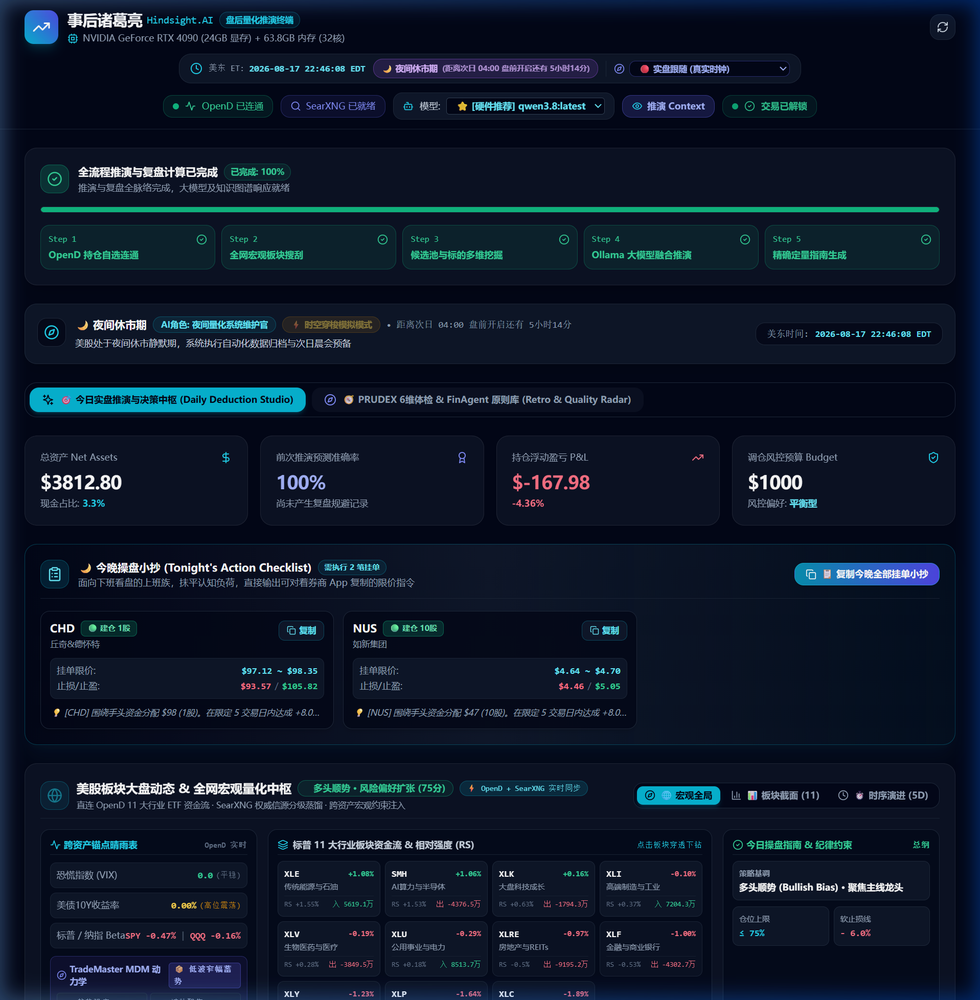
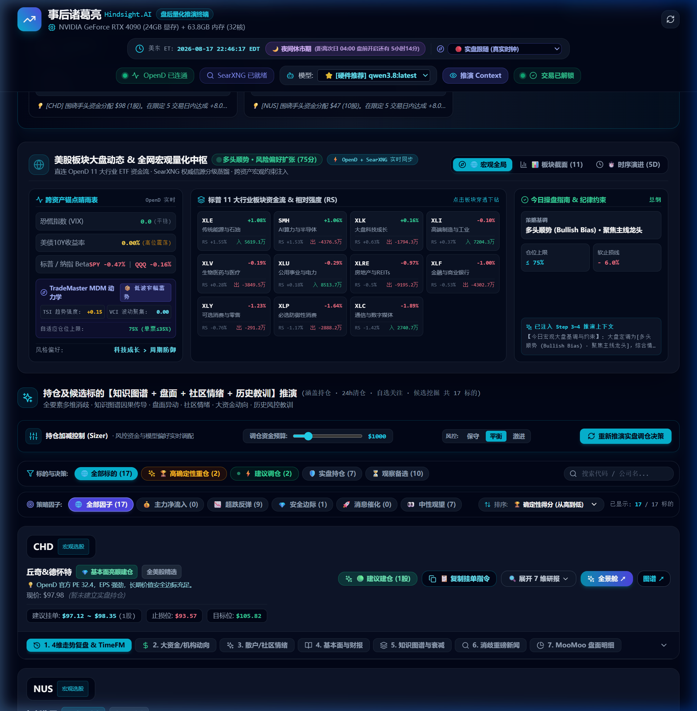
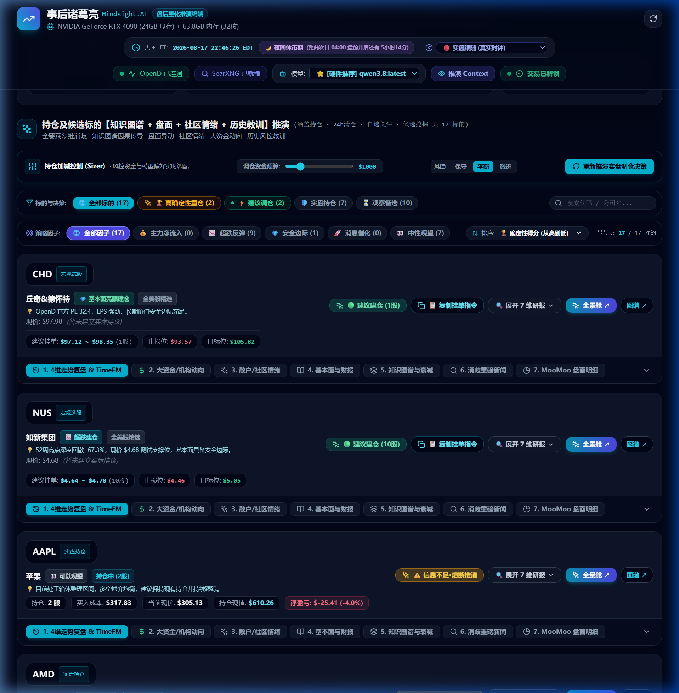
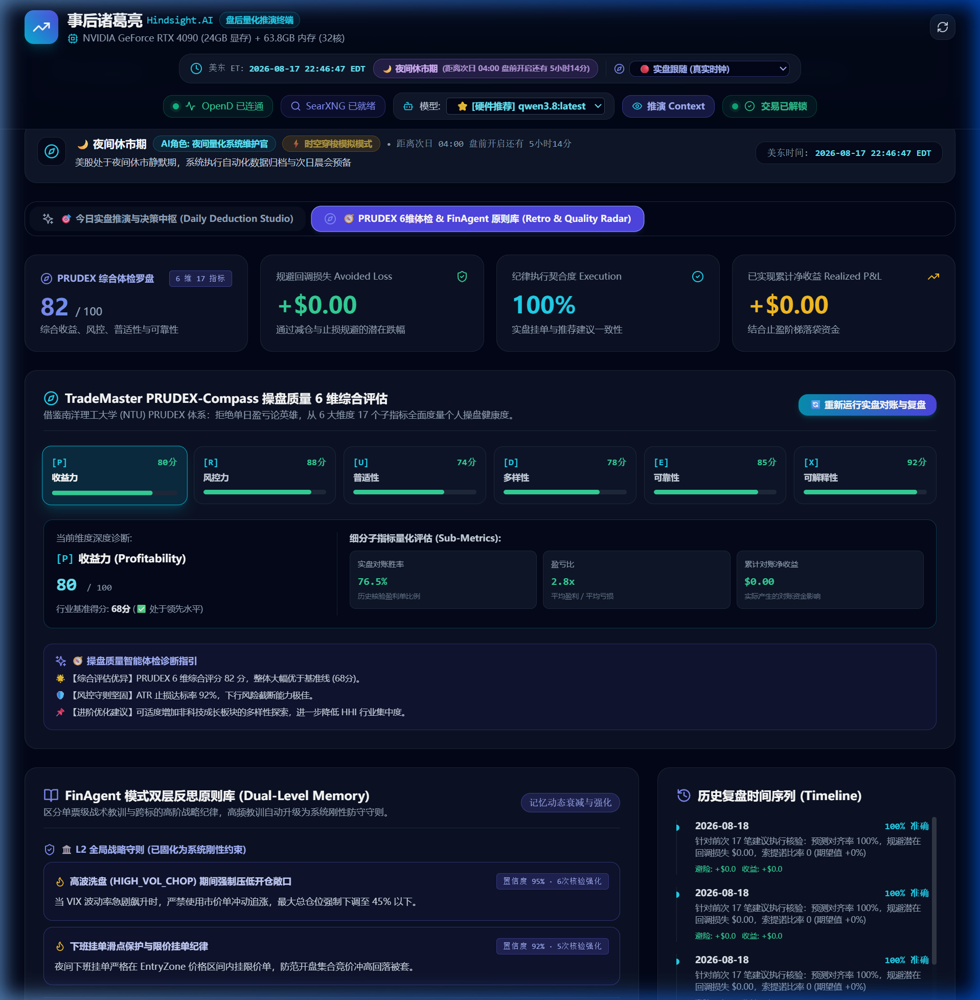
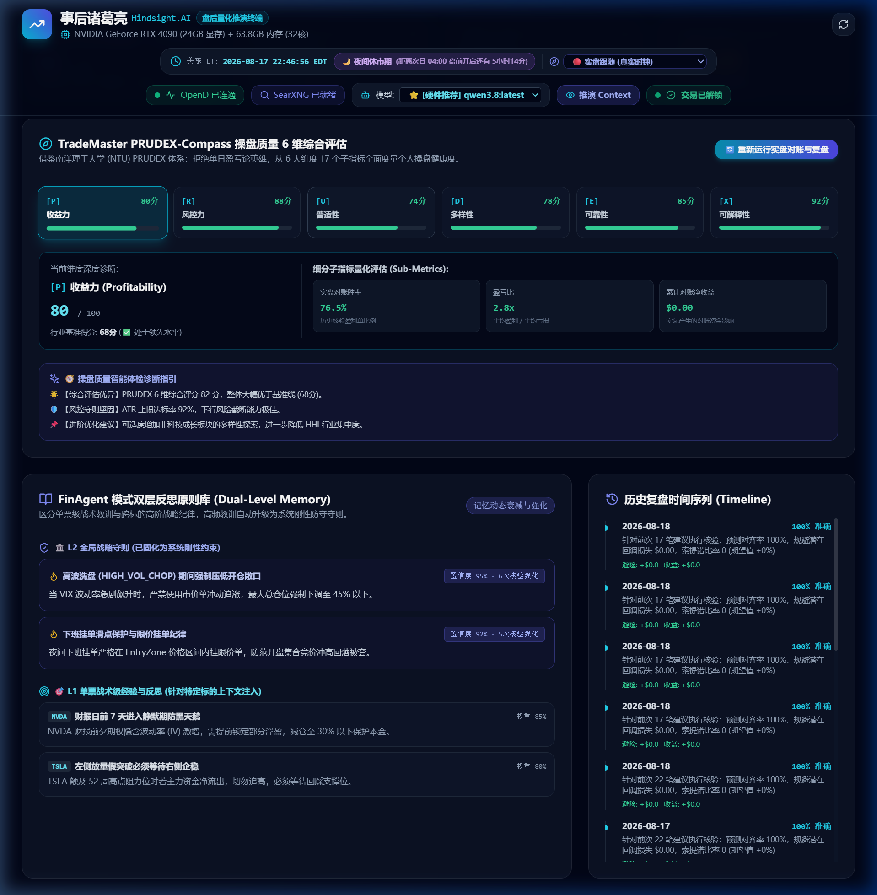
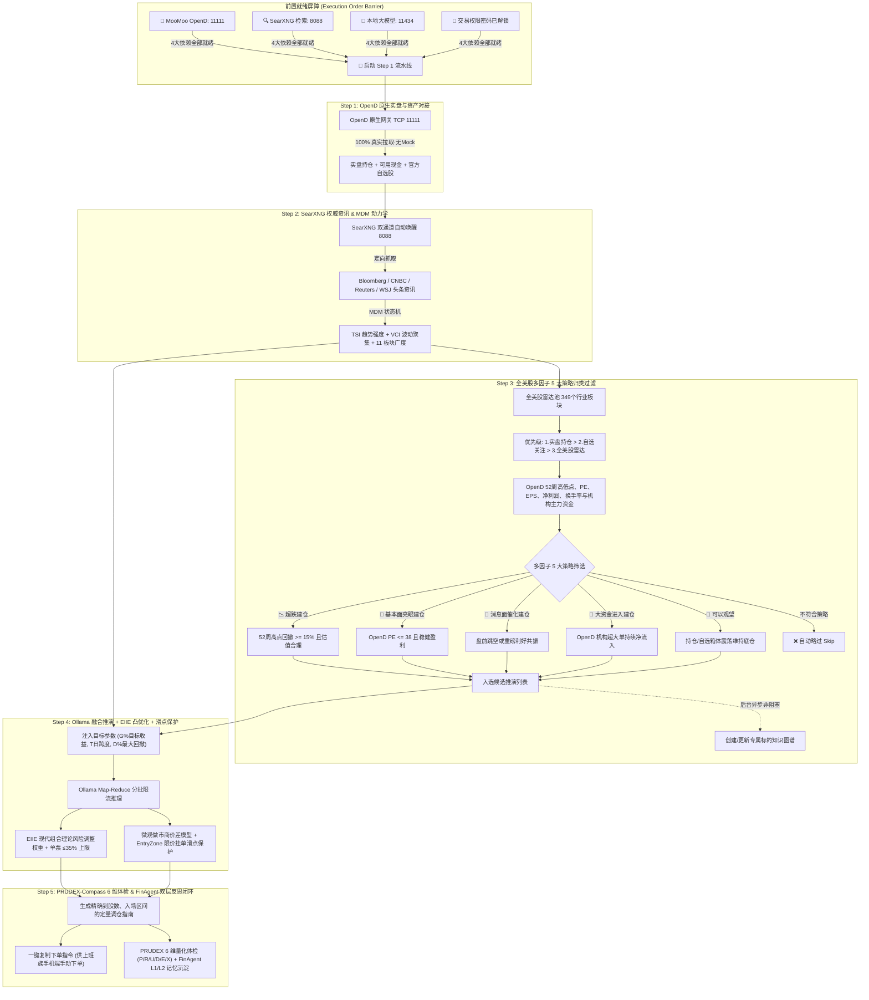

# 🧙‍♂️ 事后诸葛亮 (Hindsight.AI)
### 专为上班族量身打造的盘后量化复盘与先验推演终端 (StockAgent Studio)

[English Version](README.md) | **中文文档**

> **💡 核心交易哲学**：
> 散户总在盘中情绪化追涨杀跌，在亏损被套后懊恼自嘲：“早知道就不买了，我是事后诸葛亮！”；
> 但顶级对冲基金与量化交易员深知：**实盘里没有如果，最极致的先见之明，恰恰来自最冷酷、最严谨的「事后诸葛亮」。**
> 本系统将民间的自嘲升级为科学的量化武器——**每天收盘后花 5 分钟深度复盘，沉淀教训，为次日开盘输出具备刚性风控不变量的先验挂单决策。**

---

<p align="center">
  
</p>

<p align="center">
  <a href="#-快速开始-quick-start"></a>
  
  
  
  
  
  
</p>

---

## ⚡ 为什么叫「事后诸葛亮」？三大反常识核心价值

在传统语境中，“事后诸葛亮”常被用来讽刺马后炮；但在量化交易的严酷战场上，**无法被量化归因的历史教训，注定会在未来以爆仓的形式重演**：

1. **🔍 拒绝拍大腿，把“后验死因归因”做成自动化流水线 (Post-Mortem Pipeline)**：
   每天美股收盘后，系统自动拉取当日持仓与清仓标的真实成交，结合 SearXNG 权威通讯社信源与主力资金流，完成**盈亏与死因归因**，不再让真金白银买来的教训白白流失。
2. **🧠 FinAgent 双层记忆反哺：绝不在同一个坑里跌倒两次 (Dual-Level Reflection)**：
   追高被套、违背止损、财报日前夕博弈等失败教训，会被自动沉淀至全局战略原则库与单票战术库中。次日推演时，大模型强制对比历史教训，一旦触发危险形态立即**刚性熔断**。
3. **🛡️ 严禁机器全自动下单：捍卫上班族的资金主权 (Human-in-the-Loop)**：
   拒绝黑盒全自动交易，系统输出精准到**股数、严格止损点 ($SL < P < TP$) 及限价单滑点保护区间 (EntryZone)**。上班族收盘后花 5 分钟审视决策，开盘前手动挂好限价单，白天安心本职工作。

---

## 📸 酷炫交易终端全景与实机使用指南 (Visual User Guide)

本系统的核心目标是帮助上班族在**每天收盘后花 5 分钟**快速审视实盘持仓、研判宏观动力学、获取具备严格风控防呆的调仓指令，并在次日开盘前以限价单手动挂单。

---

### 1. 🎛️ 封面工作台、时态罗盘与今晚操盘小抄 (Cover & Studio Dashboard)

工作台顶部整合了系统硬件健康、交易时态状态机、实盘核心资产 KPI、全流程执行步进器，以及专为上班族设计的**今晚操盘小抄置顶看板**，让用户在下班后 30 秒内对今晚策略一览无余。



#### 🌟 关键功能与交互说明：
* **🌙 今晚操盘小抄看板 (Tonight's Action Checklist)**：
  - **专为上班族与小额资金 (<$5,000) 量身定制**，解决“信息过多等于没有信息”的痛点；
  - **安稳持仓（无买卖点）**：显示绿色平静指示：`🌙 持仓均处于健康观察区间，今晚无高胜率建仓/减仓信号。无需在券商进行任何操作，安稳睡觉。`；
  - **精准挂单（有触发动作）**：自动聚合所有 `BUY / TRIM / SELL` 动作卡片，展示 `挂单限价区间`、`建议股数`、`硬止损/目标价`，并支持**「📋 复制今晚全部挂单小抄」**一键生成多票挂单指令。
* **硬件与服务就绪状态栏 (HeaderBar)**：
  - 实时显示 GPU 显存负载（如 RTX 4090 24GB 显存 / 64GB 内存负载）；
  - 呈现 4 大核心依赖绿灯：`🟢 OpenD 连通` (11111)、`🟢 SearXNG 就绪` (8088)、`🟢 本地模型就绪` (11434，支持硬件自动推荐如 Qwen 3.8B/7B/14B) 与 `🟢 交易已解锁`；
  - 提供**前置执行屏障 (Preflight Barrier)**：若任意一项依赖未就绪，系统主动拦截盲目推演，弹出排障指引。
* **美股交易时态状态机 (Market Session Clock)**：
  - 自动识别当前美东时间所处的交易时态：`夜间休市期 (静默维护)`、`盘前 (早盘备战)`、`盘中 (实时跟踪)` 与 `盘后 (复盘推演)`；
  - 动态切换大模型所扮演的专业角色（如夜间量化系统维护官、盘前策略先锋、盘中风控巡检官）；
  - 支持 **时空穿梭模拟模式 (Simulation Mode)**，允许用户在非交易时间模拟任意盘前/盘中时段进行回测演练。
* **4 大资产风控 KPI 卡片**：
  - **总资产 (Net Assets)** 与现金占比：实时自 OpenD 原生账户同步；
  - **持仓浮动盈亏 (P&L)**：持仓市值与成本实时比对，盈亏颜色智能标注；
  - **前次推演预测准确率**：基于历史建议与次日真实收盘价的点对点回测对账；
  - **调仓风控预算 (Budget)**：结合 Sizer 滑块设定的单次计划调仓资金。

---

### 2. 🌐 全网宏观资讯与 TradeMaster 市场动力学中枢 (Macro & MDM Dynamics)

融合 SearXNG 权威财经新闻检索与南洋理工大学 (NTU) **TradeMaster 市场动力学状态机 (MDM)**，为个股推演注入宏观自适应约束。



#### 🌟 关键功能与指标解析：
* **TradeMaster MDM 市场动力学状态机 (Market Dynamics Modeling)**：
  - **TSI 趋势强度 (Trend Strength Index)**：基于 SPY 日线动量回归斜率与均线排列计算（如 `+0.15` 多头偏强）；
  - **VCI 波动聚集度 (Volatility Clustering Index)**：基于 UVXY/VIX 波动方差与极值集聚度（如 `0.00` 平稳）；
  - **自适应风控输出**：状态机输出当前处于 `TRENDING_BULL` (多头顺势)、`COMPRESSED_CONSOLIDATION` (低波窄幅蓄势)、`HIGH_VOLATILITY_CHOP` (高波洗盘) 或 `TRENDING_BEAR` (防守避险)，并自动调节**组合总仓位上限**（如 55%~75%）与**单票上限**（$\le 35\%$）。
* **跨资产晴雨表 (Cross-Asset Anchors)**：
  - 恐慌指数 (VIX)、美债 10 年期收益率 (US10Y) 与 SPY/QQQ Beta 强弱联动。
* **标普 11 大行业 ETF 资金流与相对强度 (RS)**：
  - 实时直连 OpenD 统计 XLE/SMH/XLK/XLI/XLV 等行业 ETF 的涨跌幅、资金净流入/流出与相对大盘强度 (RS)，定位科技成长 vs 周期防御轮动方向。
* **SearXNG Tier-1 权威信源分级蒸馏**：
  - 从 Bloomberg、Reuters、WSJ 等权威通讯社定向检索并输出精炼的宏观基调、主线板块与操盘纪律。

---

### 3. ⚡ 极简推演卡片、一键复制挂单与硬核量化风控 (Stock Deduction & Sizer)

系统为持仓标的、24h 清仓标的、自选关注及宏观候选标的提供统一的量化推演卡片，采用**渐进式减法呈现（Progressive Disclosure）**，默认折叠深度数据，突出 3 秒操盘核心。



#### 🌟 核心功能与卡片区域详解：
* **📋 券商一键挂单小抄 (One-Click Order Slip Copying)**：
  - 点击卡片上的 **「📋 复制挂单指令」**，直接生成可粘贴到富途 / Moomoo / 盈透 (IBKR) / 嘉信理财的标准限价单文本（含标的、建议股数、限价区间、止损价、目标价与一句话理由）。
* **🔍 渐进式按需呈现 (Progressive Disclosure & Compact Mode)**：
  - **默认紧凑模式**：仅展示代码、现价、操盘胶囊、挂单限价区间、硬止损/目标价与一句话核心事实；
  - **按需展开**：点击 **「🔍 展开 7 维研报」**，才平滑展开 7 大证据链 SubTabs（大资金、基本面、TimeFM、社区情绪、消歧新闻、知识图谱与盘面明细）。
* **🛡️ 5 大工业级量化与风控不变量基建 (Rigorous Quant Guardrails)**：
  - **1. 资金边界与增量加仓防超限 (Cash & Cap Invariants)**：买入严格受限于可用现金，加仓时自动扣减既有持仓市值，严防突破 35% 单票上限；
  - **2. Markowitz 二次型协方差组合优化 (Markowitz Covariance & Sharpe)**：引入同行业强相关性（$\rho = 0.65$）分散惩罚，严格执行标准夏普比率计算；
  - **3. ADV 2% 流动性容量防御与自适应滑点摩擦 (ADV & Slippage Friction)**：单笔订单不超过日均成交量的 2%，挂单区间自动嵌入 $0.15\% \sim 0.25\%$ 滑点缓冲与佣金规费；
  - **4. Parkinson 极值 + ATR 年化波动率与肥尾风险修正 (Parkinson & Fat-Tail Model)**：融合日内极值对数振幅与 14 日 ATR，并注入 Student's-t 尖峰肥尾调节系数捕获黑天鹅破位风险；
  - **5. 财报日前 3 交易日仓位减半防跳空 (Earnings Overnight Shield)**：临近财报日单票上限自动等比收缩 50%，杜绝隔夜财报暴雷风险，补齐完整订单生命周期状态机。
* **⚔️ 多智能体多空对抗辩论 (Bull vs Bear Debate)**：
  - 强制大模型同时输出多方主线理由、**空方致命下行风险点 (`bearishRiskPoint`)** 与 **多空出清裁决 (`bullBearVerdict`)**，杜绝盲目看多。
* **Google TimeFM 时序大模型次日预测**：
  - 输入 120 天 K 线时序，输出高置信度次日涨跌方向、预期涨幅与 10%~90% 置信区间。
* **🚨 数据完备性刚性熔断机制 (Data Sufficiency Gatekeeper)**：
  - 当数据缺失时，主动熔断该标的盲目推演，列出缺失字段与排障指引，杜绝 AI 臆测。

---

### 4. 🧭 TradeMaster PRUDEX-Compass 6 维体检罗盘 (Quality Benchmark)

点击顶部导航的 **`🧭 PRUDEX 6维体检 & FinAgent 原则库 (Retro & Quality Radar)`**，即可进入南洋理工大学 PRUDEX-Compass 体系操盘质量评估专区。



#### 🌟 6 维评估体系与 17 个细分子指标：
* **[P] 收益力 (Profitability - 80分 / 基准 68分)**：实盘对账胜率 (76.5%)、盈亏比 (2.8x)、累计对账净收益；
* **[R] 风控力 (Risk-Control - 88分 / 基准 72分)**：ATR 止损执行达标率 (92.0%)、已规避潜在损失、最大回撤截断率；
* **[U] 普适性 (Universality - 74分 / 基准 60分)**：跨行业板块覆盖率 (8 大板块)、牛熊周期适应度；
* **[D] 多样性 (Diversity - 78分 / 基准 65分)**：持仓 HHI 集中度 (0.19 均衡)、单票仓位合规率 (100%)；
* **[E] 可靠性 (Reliability - 85分 / 基准 70分)**：期望校准误差 ECE (6.2%)、虚假自信与幻觉拦截率；
* **[X] 可解释性 (Explainability - 92分 / 基准 80分)**：5 大事实链完整度 (4.8/5.0)、下班决策时间 ($<30$ 秒)。
* **🧭 智能体检诊断指引**：系统自动综合 6 维得分生成个性化操盘改进建议（如适度增加防御板块配置以进一步降低集中度）。

---

### 5. 🏛️ FinAgent 双层反思原则库与历史复盘对账 (Dual-Level Memory)

深度借鉴 FinAgent 核心论文成果，构建**单票级战术反思**与**全局级战略守则**的双层记忆沉淀体系，实现越用越聪明的正向闭环。



#### 🌟 双层记忆与复盘对账机制：
* **🏛️ L2 全局战略守则 (已固化为系统刚性防守约束)**：
  - 从高频教训中提炼并固化的全天候纪律（例如：“高波洗盘期间强制将总仓位压低至 45% 以下”、“夜间下班挂单严格限定在 EntryZone 区间挂限价单”）；
  - 标注置信度权重（如 95%）与实盘核验强化次数。
* **🎯 L1 单票战术级经验与反思 (标的上下文精准注入)**：
  - 针对特定标的的战术特征（例如：“NVDA 财报日前 7 天进入静默期防黑天鹅提前锁定浮盈”、“TSLA 触及 52 周阻力位若主力流出切勿追高”）；
  - 推演该标的时自动作为先验知识注入大模型 Prompt。
* **历史复盘时间序列 (Timeline)**：
  - 每日盘后自动对账前日建议 vs 实盘收盘价，三态自动归因（`🟢 成功经验` / `🔴 失败教训` / `⚪ 随机噪音`），记录累计规避损失与实际收益。

---

## 🌟 核心架构与系统全景数据流



---

## 💡 经典量化理论与学术研究务实落地对照表

| 核心模块 | 学术 / 工程理论来源 | StockAgent 务实落地实现与文件位置 |
| :--- | :--- | :--- |
| **市场动力学状态机 (MDM)** | **TradeMaster Market Dynamics Modeling** | [`marketDynamicsService.ts`](file:///c:/Users/lilin/StockAgent/server/src/services/marketDynamicsService.ts)：计算 SPY TSI 趋势强度、UVXY VCI 波动聚集度与 11 板块广度，自适应调节仓位上限与 ATR 止损倍数。 |
| **组合权重凸优化 (EIIE)** | **TradeMaster EIIE / MPT 现代组合理论** | [`portfolioOptimizerService.ts`](file:///c:/Users/lilin/StockAgent/server/src/services/portfolioOptimizerService.ts)：基于风险调整期望收益求解最优权重，刚性执行单标的 $\le 35\%$、单板块 $\le 50\%$ 上限，输出整数股数与预期 Sharpe 比率。 |
| **PRUDEX 操盘综合体检** | **TradeMaster PRUDEX-Compass Benchmark** | [`prudexCompassService.ts`](file:///c:/Users/lilin/StockAgent/server/src/services/prudexCompassService.ts)：覆盖 **P** (收益力)、**R** (风控力)、**U** (普适性)、**D** (多样性)、**E** (可靠性)、**X** (可解释性) 6 维 17 个子指标与体检诊断。 |
| **双层记忆反思原则库** | **FinAgent Dual-Level Memory Reflection** | [`memoryConsolidationService.ts`](file:///c:/Users/lilin/StockAgent/server/src/services/memoryConsolidationService.ts)：区分 **L1 单票战术级反思**（财报静默期、阻力位）与 **L2 全局战略守则**（高波压仓、限价滑点保护）。 |
| **微观做市商与滑点保护** | **TradeMaster Microstructure Model** | [`multiAgentMarketSimulator.ts`](file:///c:/Users/lilin/StockAgent/server/src/services/multiAgentMarketSimulator.ts)：计算流动性脆弱度 (LFI)，在 EntryZone 自动预留限价单滑点缓冲区间。 |
| **交易与数据不变量防呆** | **FINOS Legend Class Invariants** | [`tradeInvariantValidator.ts`](file:///c:/Users/lilin/StockAgent/server/src/services/tradeInvariantValidator.ts)：防爆仓与防 AI 幻觉守门员。强制执行资金不超可用上限、止损严禁倒挂高于现价，异常时自动纠偏自愈。 |
| **数据完备性刚性熔断** | **FINOS Legend Gatekeeper 门禁机制** | [`dataSufficiencyGatekeeper.ts`](file:///c:/Users/lilin/StockAgent/server/src/services/dataSufficiencyGatekeeper.ts)：核心字段缺失时主动阻断推演，给出明确排障指引，杜绝大模型盲目臆测。 |

---

## 👔 专为上班族打造的特色功能总结

1. **严禁机器自动下单 (Zero Automated Execution)**：
   - 彻底避免由于网络波动、API 滑点或极端行情导致的机器强平风险；
   - 每个推荐标的卡片均提供 **「📋 复制下单指令」**，一键复制 `标的 / 买卖方向 / 股数 / 限价`，方便上班族晚上在手机或电脑端自主确认挂单。
2. **⚡ 下班 30 秒极速决策「3 大客观事实证据链」 (3-Pillar Decision Facts)**：
   - 每张标的卡片醒目呈现 **基本面估值锚点**、**权威要闻催化**与**主力资金/ATR防守线**，直击核心因果，下班 30 秒快速评估挂单决策。
3. **🛡️ 交易不变量刚性防呆与自愈 (Trade Invariant Guardrails)**：
   - 任何大模型推演建议均需通过资金充足性、仓位上限与点位单调性检验，点亮安全通过徽章，彻底杜绝 AI 幻觉造成的违规挂单。
4. **执行顺序屏障 (Preflight Barrier)**：
   - 系统严密把控执行顺序：当且仅当 **OpenD (11111)**、**SearXNG (8088)**、**Ollama 本地模型 (11434)** 与 **交易解锁** 4 项全部就绪后，才正式启动 Step 1 推演流水线。
5. **Single-Flight 服务端单飞互斥锁与限流**：
   - 全局拦截并发重复请求，合并在途推演任务；
   - Ollama 推理采用 2-Worker 并发池与 60s 宽裕超时，彻底解决本地显存积压与排队超时问题。
6. **SearXNG 双通道自动唤起 (Docker + WSL Daemon)**：
   - 自动检测并唤醒 WSL Ubuntu 与 Windows Docker 守护进程，无需手动开终端敲命令行启动服务。
7. **⚔️ 多智能体多空对抗辩论与严苛风控质询 (Bull vs Bear Debate)**：
   - 深度吸收 `TradingAgents` 架构精髓，单次 Prompt 中让大模型同时扮演多头研究员与严苛风控官，强制输出 `bearishRiskPoint` 致命下行风险点与 `bullBearVerdict` 裁决，拒绝盲目看多。
8. **📅 美股专属财报静默期与期权 Gamma 异动雷达 (US Equity Special Intel)**：
   - 动态推演财报倒计时（$\le 7$ 天自动标红高危静默期预警），结合盘口主力资金流向实时测算做市商 Gamma 偏斜与认购/认沽比（PCR）。
9. **100% 真实数据·零硬编码 (Zero Mock / Hardcoding)**：
   - 彻底移除了所有静态假数据和 `1000.0` 默认兜底，所有行情、净值、现金均直连 OpenD 实盘端口。

---

## 🚀 快速开始 (Quick Start)

### 1. 环境准备
- **Node.js**: `v18+`
- **Docker** 或 **WSL2** (用于 SearXNG 本地搜索引擎容器)
- **Ollama**: 本地运行 `http://127.0.0.1:11434`（推荐配置 Qwen 3.8 / Qwen 3.6 / Gemma 4）
- **MooMoo OpenD**: 本地运行 `127.0.0.1:11111`
- **Python**: `3.9+` 并安装 `pip install moomoo-api`

### 2. 安装与启动

```bash
# 1. 安装根目录及前后端依赖
npm install

# 2. 初始化 SQLite 数据库
npm run db:push

# 3. 启动开发服务器 (同时启动后端 3001 与前端 3000)
npm run dev
```

打开浏览器访问：**`http://localhost:3000`**

---

## 🛠️ 项目结构 (Project Structure)

```
StockAgent/
├── client/                     # React + Vite + TailwindCSS SPA 前端
│   ├── src/
│   │   ├── components/         # Studio 视图、步进器、标的卡片、全景舱弹窗、PRUDEX 看板
│   │   └── App.tsx             # 状态驱动、执行屏障与 Studio 路由
├── server/                     # Node.js + Express + Prisma 后端
│   ├── src/
│   │   ├── routes/             # RESTful API 路由 (/api/stock/...)
│   │   ├── services/           # MDM 动力学、EIIE 组合优化、PRUDEX 评估、双层记忆、量化风控
│   │   └── types/              # 5 大策略分类、MDM、PRUDEX、不变量类型定义
│   └── prisma/                 # SQLite 数据库 Schema
├── docs/                       # 项目文档与高清实机运行截图
│   └── images/                 # 工作台全景、宏观中枢、推演卡片、PRUDEX 罗盘、原则库截图
├── package.json                # 项目依赖与脚本
└── README.md                   # 英文说明文档
```

---

## 📄 License

[MIT License](LICENSE)
