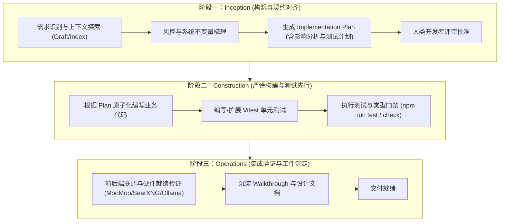

# 📘 StockAgent (事后诸葛亮) AI-DLC 研发与测试工作流规范

> **AI-DLC (AI-Driven Development Life Cycle)** 是专为 AI 辅助编程量身定制的全生命周期工程规范。
> 结合本项目作为**美股盘后量化复盘与先验推演终端**的特殊属性，本规范旨在消除 AI 编码过程中的“幻觉风险”、“上下文漂移”与“风控破坏”，实现高可信、高质量的量化软件交付。

---

## 🎯 核心原则

1. **Human-in-the-Loop (人机共治)**：
   - 机器负责深度推演、模式识别与代码草案编写，人类负责战略决策与方案评审。
   - 严禁 AI 在未获人类审查前对复杂量化算法和底层状态机进行黑盒大重构。
2. **Invariant First (刚性风控不变量优先)**：
   - 金融量化代码容错率为零。任何涉及仓位计算、止盈止损、挂单区间的逻辑，必须具备数学上严密的形式化不变量校验。
3. **Adaptive Rigor (自适应工程严谨度)**：
   - **重大改动 (High Rigor)**：涉及核心引擎（如 `dailyStrategyDirector`、`multiAgentMarketSimulator`、`tradeInvariantValidator` 等）必须严格走完三阶段（Inception 方案设计 → Construction 测试先行 → Operations 验收）。
   - **局部优化 (Low Rigor)**：界面样式修正、文档微调走轻量快速迭代。

---

## 🔄 三阶段研发流水线 (3-Phase Lifecycle)

---

## 📋 详细阶段指南

### 阶段一：Inception (构想与契约对齐)
- **目标**：在写任何代码前，明确“改什么、为什么改、影响什么、如何验证”。
- **执行动作**：
  1. 查阅 `graft/INDEX.md` 或架构卡片，锁定修改模块的调用上下游。
  2. 检查改动是否触及交易不变量（如 $SL < P < TP$、滑点保护、数据门禁 `dataSufficiencyGatekeeper`）。
  3. 输出包含 **组件影响范围**、**接口 Schema 变动**、**测试用例规划** 的结构化方案。
  4. 提交给人类开发者确认后，方可进入构建阶段。

### 阶段二：Construction (严谨构建与测试先行)
- **目标**：以小步快跑、测试兜底的方式编写高质量代码。
- **执行动作**：
  1. **原子化编辑**：针对 `server/src/services/` 下的大型文件（如 >1000 行的代码），采用局部精确替换，保留既有注释与架构。
  2. **测试优先**：
     - 在 `server/src/services/__tests__/` 同步补充或更新 Vitest 测试用例。
     - 重点测试极端值、空数据降级、除零保护及风控边界。
  3. **门禁验证**：
     - 运行 `npm run test`（后端所有 Vitest 测试通过）。
     - 运行 `npm run check`（TypeScript 静态检查无报错）。

### 阶段三：Operations (集成验证与工件沉淀)
- **目标**：完成端到端就绪性检查与知识沉淀。
- **执行动作**：
  1. 检查前后端构建状态（`npm run build`）。
  2. 验证系统四项核心前置依赖状态：
     - `🟢 MooMoo OpenD (11111)`
     - `🟢 SearXNG 本地搜索 (8088)`
     - `🟢 Ollama 本地模型 (11434)`
     - `🟢 交易风控解锁状态`
  3. 更新相应的文档与变更记录，确保跨会话无损恢复。

---

## 🛠️ 常用开发与测试指令

| 命令 | 说明 | 适用场景 |
| :--- | :--- | :--- |
| `npm run test` | 运行服务端全部 Vitest 单元测试 | Construction 阶段测试门禁 |
| `npm run check` | 对服务端与客户端进行全局 TypeScript 类型检查 | 提交与交付前静态门禁 |
| `npm run build` | 全量构建服务端与客户端生产包 | Operations 阶段构建验证 |
| `npm run dev` | 并行启动客户端与服务端开发服务器 | 本地联调与功能验证 |
